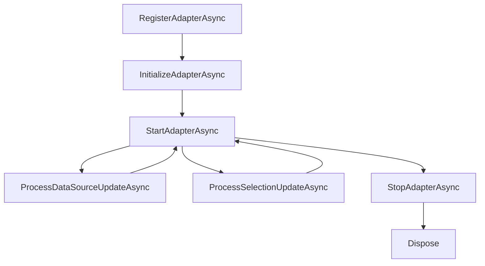

# Building an Adapter Using The Adapter Template

Use the following instructions to build a new adapter on the Adapter Framework, starting from the adapter template.

## What you are building

An adapter collects data from a data source (a device, protocol, file, API, etc.), transforms it, and forwards it to a storage endpoint (Edge Data Store, CONNECT, or PI Server) using the Open Message Format (OMF) specification. Every adapter is built upon the Adapter Framework, which provides essential features like configuration REST APIs, logging, health monitoring, and egress capabilities inherently, requiring you only to develop the code pertinent to your specific data source. 

This section provides the information required to create, configure, build, and run an adapter using the Adapter Framework and the provided adapter template.

---
## Create your adapter solution

Use the adapter template to generate a new adapter solution. The template provides the foundational components required to build, configure, test, and run an adapter on the Adapter Framework. 

1. Generate an adapter projects using steps specified in [Local Installation Steps](./Source/Template/README.md) 

2. Open the generated project folder in Visual Studio Code or an Integrated Development Environment (IDE) of your choice. 

3. Run `dotnet build` in the integrated terminal to confirm the adapter project runs successfully with no errors. 

## Understand the components

Using the following list, review the generated component before making changes. This will help implement custom adapter functionality in the correct locations. 

- **AdapterMain.cs** - This serves as the starting point. Begin and end data collection and respond to any configuration updates here. 
- **Configuration/DataSourceConfiguration.cs** - Contains properties needed to connect to your data source, such as IP address, port, or credentials. 
- **Configuration/DataSelectionItem.cs** - Contains the properties needed to describe what data to collect. For example, one entry per data point/tag/item. 
- **AdapterConstants.cs** - Contains adapter-wide constants, such as the default stream ID pattern. 
- **appsettings.json** - Serves as the default port and application data directory. 
- **Test/** - Includes the unit test projects

## Implement your adapter
Implement the adapter-specific functionality required to communicate with your data source and publish data through the Adapter Framework. This includes configuring source connectivity, collecting data, mapping measurements, and implementing any required lifecycle behaviors. 

### Connect to your data source
Add the properties your adapter needs to connect, such as the host, port, credentials) to the `DataSourceConfiguration.cs`. 

1. Implement `Equals()` and `Validate()` for it. 
2. Be sure to include the `[Protected]` attribute on properties that hold sensitive information, such as passwords, connection strings, or API keys. 

### Define the data to collect

1. Add the properties you need to identify or select a data item. such as register address or field name) to `DataSelectionItem.cs`. 
2. Add `IEquatable<DataSelectionItem>` and create a `Validate()method`. 

### Implement the adapter lifecycle in `AdapterMain.cs`

In the AdapterMain.cs, override the following methods as needed:

| Method | Purpose |
|---|---|
| `RegisterAdapterAsync` | Register custom configuration facets (when needed) and set the default stream ID pattern. |
| `InitializeAdapterAsync` | One-time adapter initialization. |
| `StartAdapterAsync` | Start collecting data — called once valid data source configuration exists. |
| `StopAdapterAsync` | Stop collecting data. |
| `ProcessDataSourceUpdateAsync` | React to data source configuration changes. |
| `ProcessSelectionUpdateAsync` | React to data selection configuration changes. |
| `GetDefaultStreamId` | Generate a default stream ID when none is configured. |
| `Dispose` | Clean up any resources you allocated. |



### (Optional) Use the built-in scheduler
If your adapter polls a data source on a scan-based interval rather than subscribing to it, use the built-in scheduler instead of writing your own timer or polling loop. It provides a reliable method to set scan rates and offers scan statistics (such as skipped scans, maximum scan time, and more) immediately. 

1. Modify `DataSelectionItem` to implement `IScanDataSelectionConfiguration` to add a `ScheduleId` property rather than `IDataSelectionConfiguration`. 
2. In the `AdapterMain` constructor, set `EnableScheduling = true`. 
3. Instead of writing your own polling loop, override `SampleDataAsync`: 

```csharp
protected override async Task SampleDataAsync(string scheduleId, IReadOnlyList<DataSelectionItem> items, CancellationToken cancellationToken)
{
    // Called whenever the schedule identified by scheduleId is due.
    // items = the data selection items associated with that schedule.
}
```

4. After enabling, configure a **Schedules** facet (`Id`, `Period`, `Offset`) and assign each data selection item to a schedule through its `ScheduleId`. 

### Create types, streams, and send data

Before sending data values, the adapter must send the OMF **type(s)** and **stream(s)** at least once. 

Use the common service methods available through `CommonService` (of type `IAdapterCommonService`) to build type/stream IDs, then send everything through the message processor:

```csharp
MessageProcessor.WriteType(dataTypes);
MessageProcessor.WriteTypes(dataTypes);
MessageProcessor.WriteStream(dataStream);
MessageProcessor.WriteStreams(dataStreams);
MessageProcessor.WriteDynamicValue(selectionItem, value);
```

Refer to the [../Sample/README.md](../Sample/README.md) for additional details.

---
