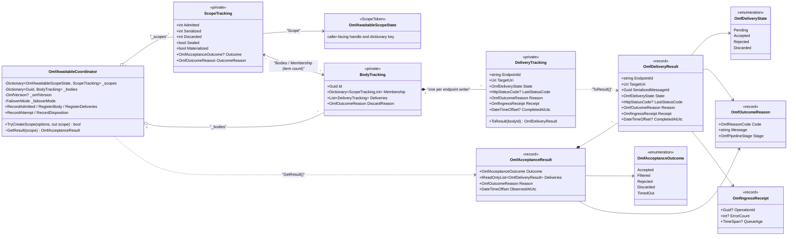

```mermaid
classDiagram
    direction LR

    class OmfAwaitableCoordinator {
        -Dictionary~OmfAwaitableScopeState, ScopeTracking~ _scopes
        -Dictionary~Guid, BodyTracking~ _bodies
        -OmfVersion? _omfVersion
        -FailoverMode _failoverMode
        +TryCreateScope(options, out scope) bool
        +RecordAdmitted / RegisterBody / RegisterDeliveries
        +RecordAttempt / RecordDisposition
        ~GetResult(scope) OmfAcceptanceResult
    }

    class OmfAwaitableScopeState {
        <<ScopeToken>>
        caller-facing handle and dictionary key
    }

    class ScopeTracking {
        <<private>>
        +int Admitted
        +int Serialized
        +int Discarded
        +bool Sealed
        +bool Materialized
        +OmfAcceptanceOutcome? Outcome
        +OmfOutcomeReason OutcomeReason
    }

    class BodyTracking {
        <<private>>
        +Guid Id
        +Dictionary~ScopeTracking,int~ Membership
        +List~DeliveryTracking~ Deliveries
        +OmfOutcomeReason DiscardReason
    }

    class DeliveryTracking {
        <<private>>
        +string EndpointId
        +Uri TargetUri
        +OmfDeliveryState State
        +HttpStatusCode? LastStatusCode
        +OmfOutcomeReason Reason
        +OmfIngressReceipt Receipt
        +DateTimeOffset? CompletedAtUtc
        +ToResult(bodyId) OmfDeliveryResult
    }

    class OmfAcceptanceResult {
        <<record>>
        +OmfAcceptanceOutcome Outcome
        +IReadOnlyList~OmfDeliveryResult~ Deliveries
        +OmfOutcomeReason Reason
        +DateTimeOffset ObservedAtUtc
    }

    class OmfDeliveryResult {
        <<record>>
        +string EndpointId
        +Uri TargetUri
        +Guid SerializedMessageId
        +OmfDeliveryState State
        +HttpStatusCode? LastStatusCode
        +OmfOutcomeReason Reason
        +OmfIngressReceipt Receipt
        +DateTimeOffset? CompletedAtUtc
    }

    class OmfOutcomeReason {
        <<record>>
        +OmfReasonCode Code
        +string Message
        +OmfPipelineStage Stage
    }

    class OmfIngressReceipt {
        <<record>>
        +Guid? OperationId
        +int? ErrorCount
        +TimeSpan? QueueAge
    }

    class OmfAcceptanceOutcome {
        <<enumeration>>
        Accepted
        Filtered
        Rejected
        Discarded
        TimedOut
    }

    class OmfDeliveryState {
        <<enumeration>>
        Pending
        Accepted
        Rejected
        Discarded
    }

    OmfAwaitableCoordinator "1" o-- "*" ScopeTracking : "_scopes"
    OmfAwaitableCoordinator "1" o-- "*" BodyTracking : "_bodies"
    ScopeTracking --> OmfAwaitableScopeState : "Scope"
    ScopeTracking "*" <--> "*" BodyTracking : "Bodies / Membership (item count)"
    BodyTracking "1" *-- "*" DeliveryTracking : "one per endpoint writer"
    DeliveryTracking ..> OmfDeliveryResult : "ToResult()"
    OmfAwaitableCoordinator ..> OmfAcceptanceResult : "GetResult()"
    OmfAcceptanceResult "1" *-- "*" OmfDeliveryResult
    OmfAcceptanceResult --> OmfAcceptanceOutcome
    OmfAcceptanceResult --> OmfOutcomeReason
    OmfDeliveryResult --> OmfDeliveryState
    OmfDeliveryResult --> OmfOutcomeReason
    OmfDeliveryResult --> OmfIngressReceipt
```