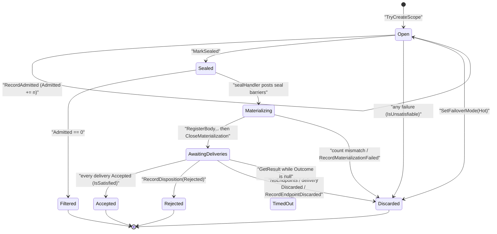

```mermaid
stateDiagram-v2
    [*] --> Open : "TryCreateScope"
    Open --> Open : "RecordAdmitted (Admitted += n)"
    Open --> Sealed : "MarkSealed"
    Sealed --> Filtered : "Admitted == 0"
    Sealed --> Materializing : "sealHandler posts seal barriers"
    Materializing --> AwaitingDeliveries : "RegisterBody... then CloseMaterialization"
    AwaitingDeliveries --> Accepted : "every delivery Accepted (IsSatisfied)"

    Open --> Discarded : "any failure (IsUnsatisfiable)"
    Materializing --> Discarded : "count mismatch / RecordMaterializationFailed"
    AwaitingDeliveries --> Rejected : "RecordDisposition(Rejected)"
    AwaitingDeliveries --> Discarded : "NoEndpoints / delivery Discarded / RecordEndpointDiscarded"
    Open --> Discarded : "SetFailoverMode(Hot)"

    AwaitingDeliveries --> TimedOut : "GetResult while Outcome is null"

    Accepted --> [*]
    Filtered --> [*]
    Rejected --> [*]
    Discarded --> [*]
```