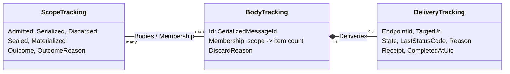

# OMF 2.0 Awaitable Acceptance: Implementation Progress

**Date:** 2026-10-07  
**Updated:** 2026-10-08, Phase 1 stragglers  
**Branch:** `features/acceptance-api`, based on 2261f3a  
**Design documents (Research repo, `4981647-test-apps/docs`):**

- `2026-09-25-adapter-framework-omf-awaitable-acceptance-confirmation-plan.md` (the plan)
- `2026-10-01-adapter-framework-omf-acceptance-only-api.md` (the acceptance-only API this branch implements)
- `2026-10-07-adapter-framework-omf-acceptance-departures.md` (where the implementation departs from the plan)

This note records what's done on the branch, how it works, and answers to questions raised during
the review.

---

## 1. Status

| Item | State |
| --- | --- |
| AW-1. `SerializationBlock` single-producer violation | Done |
| AW-2. Failover conversion drops the OMF version and partition key | Done |
| Phase 1. Contracts and coordinator | Done, including host wiring. No processor creates scopes until Phase 2. |
| Phase 2. Scope identity through grouping and serialization | Not started |
| Phase 3. Persistence | Not started |
| Phase 4. Delivery and acceptance | Not started |
| Phase 6. Hot failover | Not started |
| Phase 7. Client-level monitoring (optional) | Not started |

Phase 5 (deep confirmation) is out of scope for the acceptance-only API.

---

## 2. Changes

### 2.1 AW-1: concurrent producers into `SerializationBlock`

Two grouping blocks post to `SerializationBlock` concurrently, but it declared a single producer, so
TPL Dataflow could use a queue that isn't safe for concurrent posts.

- [SerializationBlock.cs](../Src/AdapterFramework.Data.Framework.DataFlow/SerializationBlock.cs) now passes
  `singleProducer: false`.
- [SerializationBlock_Tests.cs](../Tests/AdapterFramework.Data.Framework.DataFlow.Tests/SerializationBlock_Tests.cs)
  adds `SerializationBlock_ConcurrentProducers_HandleEveryMessageOnce`: two threads post 5,000
  messages each, for OMF 1.2 and OMF 2.0, and every message must be handled exactly once.

### 2.2 AW-2: failover keeps the OMF version and partition key

Hot failover rebuilt each body with the OMF 1.2 default and no partition key, so OMF 2.0 bodies were
resent with the wrong header.

- [FailoverSerializedOmfMessage.cs](../Src/AdapterFramework.Data.Framework.Failover/Messages/FailoverSerializedOmfMessage.cs)
  takes the OMF version and partition key and includes them in its size.
- [FailoverDataMessageProcessor.cs](../Src/AdapterFramework.Data.Framework.Failover/FailoverDataMessageProcessor.cs)
  copies both when it converts a message.
- [FailoverPersistentOmfMessageQueue.cs](../Src/AdapterFramework.Data.Framework.Failover/Messages/FailoverPersistentOmfMessageQueue.cs)
  writes `DataItemVersion.V3` records (type, item count, body, process time, partition key, action,
  OMF version) and still reads legacy `V2` records.
- Tests cover an OMF 2.0 round trip through the disk record, a legacy `V2` record, and a hot-mode
  message buffered on the secondary and sent after promotion.

**Rollback risk:** older builds ignore the record version and would misread `V3` failover records. The
plan's two-release rollout (read first, write later) isn't applied here; see the departures document.

### 2.3 Phase 1: public contracts

[Abstractions/MessageProcessing/Awaitable](../Src/AdapterFramework.Data.Framework.Abstractions/MessageProcessing/Awaitable)
holds the acceptance-only API:

| Type | Purpose |
| --- | --- |
| `IAwaitableMessageProcessor`, `IAwaitableAdapterMessageProcessor` | Create scopes with `TryCreateAwaitableScope` |
| `IAwaitableScope`, `IAwaitableMessageScope`, `IAwaitableAdapterMessageScope` | `Seal`, `WaitForAcceptanceAsync`, `DisposeAsync`, plus the existing write methods |
| `OmfAwaitableScopeOptions`, `OmfAwaitableEndpointMode` | Endpoint mode, default wait timeout (15 minutes), `FlushOnSeal` |
| `OmfAcceptanceResult`, `OmfAcceptanceOutcome` | Scope outcome and every delivery |
| `OmfDeliveryResult`, `OmfDeliveryState`, `OmfIngressReceipt` | One body sent to one endpoint |
| `OmfOutcomeReason`, `OmfReasonCode`, `OmfPipelineStage`, `OmfReasonCodeExtensions` | Why something is in its state; messages are capped at 1,024 characters |
| `ScopeToken` | Scope identity passed through the pipeline; no public members |

Reason codes have fixed numeric values, so codes added later can't shift existing ones.

### 2.4 Phase 1: coordinator

[Messages/Awaitable](../Src/AdapterFramework.Data.Framework.Messages/Awaitable) holds the coordinator.
The Messages project is the lowest project that the dataflow, buffering, endpoint manager, and egress
projects all reference.

| Type | Purpose |
| --- | --- |
| `OmfAwaitableCoordinator` | Tracks scopes, bodies, and deliveries, and decides outcomes |
| `OmfAwaitableScopeState` | One scope's sealing, waits, and disposal. It derives from `ScopeToken`, so it is also the scope's token. |
| `OmfDeliveryTarget` | One endpoint writer in the snapshot taken when a body is dispatched |

[OmfAwaitableCoordinator_Tests.cs](../Tests/AdapterFramework.Data.Framework.Messages.Tests/Awaitable/OmfAwaitableCoordinator_Tests.cs),
in the new test project `AdapterFramework.Data.Framework.Messages.Tests`, drives the coordinator
with a simulated pipeline. [OmfOutcomeReason_Tests.cs](../Tests/AdapterFramework.Data.Framework.Abstractions.Tests/MessageProcessing/Awaitable/OmfOutcomeReason_Tests.cs)
covers reason codes and message truncation. The new test project is added to `AdapterFramework.sln`
by hand, because `dotnet sln add` adds x64 and x86 configurations to every project.

### 2.5 Phase 1: host wiring

- [EgressComponentExtensions.cs](../Src/AdapterFramework.Data.Framework.EgressComponent/Extensions/EgressComponentExtensions.cs)
  registers one `OmfAwaitableCoordinator` singleton in `AddEgress`.
- [DataMessageProcessor.cs](../Src/AdapterFramework.Data.Framework.EgressComponent/DataMessageProcessor.cs)
  takes the coordinator as an optional last constructor parameter and sets the OMF version from the
  application manifest.
- [FailoverDataMessageProcessor.cs](../Src/AdapterFramework.Data.Framework.Failover/FailoverDataMessageProcessor.cs)
  takes the coordinator as an optional last constructor parameter and sets the failover mode in
  `UpdateMode`.
- Both parameters default to null, so existing callers and test doubles are unchanged.
- Tests check the singleton registration, that OMF 2.0 allows scopes and OMF 1.2 doesn't, and that
  hot mode blocks scopes until the mode changes to warm.

### 2.6 Running the tests

```powershell
dotnet test Tests\AdapterFramework.Data.Framework.Messages.Tests
dotnet test Tests\AdapterFramework.Data.Framework.Abstractions.Tests --filter "FullyQualifiedName~Awaitable"
dotnet test Tests\AdapterFramework.Data.Framework.Failover.Tests
dotnet test Tests\AdapterFramework.Data.Framework.EgressComponent.Tests
dotnet test Tests\AdapterFramework.Data.Framework.DataFlow.Tests --filter "FullyQualifiedName~SerializationBlock_Tests"
```

The DataFlow and EgressComponent suites take several minutes.

---

## 3. How the coordinator works

The coordinator keeps track of scopes in memory. Pipeline stages report what happened to each
scope's data, and the coordinator decides when a scope's outcome is final and wakes its waiters. It
never sends, retries, or cancels anything.

### 3.1 What it tracks



- **Scope:** counts of items admitted, serialized into bodies, and dropped, plus two flags. *Sealed*
  means no more writes; *materialized* means every body containing the scope's items is known.
- **Body:** one serialized HTTP body and the number of items it carries per scope. One body can
  carry several scopes' items, and one scope can span several bodies.
- **Delivery:** one body sent to one endpoint. It starts `Pending` with reason `Queued`.

A body is tracked only if it carries a scoped item, so writes made without a scope cost one failed
lookup. Reports about unknown scopes or bodies are ignored.

### 3.2 Reports from the pipeline

| Reported by | Method | Effect |
| --- | --- | --- |
| `DataMessageProcessor`, before posting to a grouping block | `RecordAdmitted` | Adds to `Admitted` |
| Any stage that drops an item | `RecordItemsDiscarded` | Adds to `Discarded`; the scope fails |
| `SerializationBlock`, before dispatch | `RegisterBody` | Creates the body and adds to `Serialized` per scope |
| `SerializationBlock`, when every barrier has arrived | `CloseMaterialization` | Sets `Materialized` and checks counts |
| `OmfEndpointManager`, before sending | `RegisterDeliveries` | One delivery per endpoint; no endpoints means `NoEndpoints` |
| `OmfWriter`, retryable attempt | `RecordAttempt` | Updates `LastStatusCode` and `Reason`; still pending |
| `OmfWriter` and queues, final decision | `RecordDisposition` | Accepted, rejected, discarded, or peer-covered; the first one wins |
| `OmfEndpointManager`, writer removed | `RecordEndpointDiscarded` | Discards that endpoint's pending deliveries |

The count check in `CloseMaterialization` catches items lost without a report: if
`Admitted > Serialized + Discarded`, the shortfall is recorded as `Discarded` (`CountMismatch`).

### 3.3 Deciding the outcome

After each report that could change a scope, the coordinator applies these rules in order:

1. If the outcome is already final, stop. Later reports still update delivery states.
2. If the report was a failure and the scope can no longer succeed, the outcome is `Rejected` or
   `Discarded`, with that report's reason. This can happen before sealing or materialization.
   - Any item was dropped, or any body was discarded.
   - `AllActiveEndpointsAtDispatch`: any delivery failed, unless the failover peer covers that body.
   - `AnyCompleteEndpoint`: no endpoint is left that could still accept every body.
3. If the scope isn't sealed, stop.
4. If nothing was admitted, the outcome is `Filtered`.
5. If the scope is materialized and every requirement is met, the outcome is `Accepted`, or
   `PeerCovered` if any body was satisfied only by the failover peer.
   - `AllActiveEndpointsAtDispatch`: every delivery of every body is accepted.
   - `AnyCompleteEndpoint`: one endpoint accepted every body.

### 3.4 Waiting

`WaitForAcceptanceAsync` seals the scope, then waits for the first of:

- **A final outcome.** It returns the outcome and a snapshot of every delivery.
- **The timeout.** It returns `TimedOut` and tracking continues, so a later wait can still see the
  outcome. The reason names the earliest unfinished stage: `AwaitingFlush` while the scope isn't
  materialized, "waiting for dispatch" when a body has no deliveries yet, and otherwise the
  earliest-stage reason among pending deliveries.
- **Scope disposal or coordinator shutdown.** It throws `OperationCanceledException`.

### 3.5 Lifecycle and threading

- `TryCreateScope` throws `NotSupportedException` unless the OMF version is 2.0 and hot failover is
  off, and returns `false` at the active-scope limit (1,000 by default, a placeholder).
- Disposing a scope frees its slot under the limit, cancels its waits, and drops bodies no remaining
  scope uses. Delivery is never cancelled.
- Disposing the coordinator is framework shutdown: every wait is cancelled and no new scopes can be
  created.
- All state changes happen under one lock. Waiters are woken after the lock is released, and their
  continuations run asynchronously, never on the reporting thread.

---

## 4. How a scope's data will flow

The pipeline steps below come from the plan. Only the coordinator exists so far.

1. **Admission (Phase 2).** A scope starts with no count. Each write through the scope runs the
   normal processor chain, including data filters. Just before `DataMessageProcessor` posts an
   envelope to a grouping block, it calls `RecordAdmitted` with that envelope's item count. Counts
   are items: values for streaming data, and one per element for types, streams, relationships,
   entities, and events. Filtered values are never counted, and a scope with nothing admitted when
   it's sealed completes as `Filtered`.
2. **Grouping (Phase 2, step 2).** Grouping blocks attach a *sidecar* to each grouped message. It's
   never serialized. Streaming values get run-length ranges `(scopeIndex, start, count)` per stream;
   discrete items get one scope index per element; unscoped data gets nothing.
3. **Serialization (Phase 2).** Serialization slices the sidecars through every split. Just before
   each body is sent on, it calls `RegisterBody` with the body's per-scope counts. Dropped items,
   such as one too large to send, are reported with `RecordItemsDiscarded`.
4. **Materialization (Phase 2).** Sealing posts a seal barrier to each grouping block the scope wrote
   to. Once a block has emitted the grouped message with the scope's last items, it sends a
   materialization barrier after it. When barriers from every touched block reach serialization, it
   calls `CloseMaterialization`, which runs the count check. Without this step the coordinator
   can't tell the last body from one still in a grouping block, so `Accepted` is never reached.
5. **Dispatch and delivery (Phase 4).** The endpoint manager calls `RegisterDeliveries` with its
   writer snapshot before sending. Each writer reports attempts and a final disposition.

Acceptance needs both: materialization closed, and every required delivery accepted.

---

## 5. Questions and answers

### 5.1 What does `OmfDeliveryResult.LastStatusCode` mean?

The status of the most recent HTTP attempt. The writer can retry a body several times, so earlier
attempts may have returned different statuses. For example, a delivery retrying a 401 shows
`LastStatusCode` 401 with reason `Delivery/Retrying`.

### 5.2 Why was `LastProcessedOperationId` removed from `OmfIngressReceipt`?

Nothing used it. Operation IDs are GUIDs, so it can't show how far the platform has progressed
relative to a body. Removing a parameter from a positional record after release would break callers,
while adding one later as an `init` property wouldn't. The acceptance-only API document was updated
to match.

### 5.3 Which choices did the plan leave open, and are they settled?

They are implemented and tested, and recorded in the departures document:

| Choice | State |
| --- | --- |
| Failures complete the outcome early, before materialization | Implemented and tested. Departs from plan §7.9. |
| `AnyCompleteEndpoint` with non-overlapping endpoint sets gives `Discarded` (`NoEndpoints`) | Implemented and tested |
| A mix of local and peer coverage gives `PeerCovered` | Implemented and tested in both endpoint modes. It can't happen in practice before Phase 6. |
| Active-scope limit of 1,000 | Placeholder; still an open decision |

### 5.4 When do non-overlapping endpoint sets occur?

Only when endpoint configuration changes during a scope, in `AnyCompleteEndpoint` mode. Each body
records the endpoint writers that exist when it's dispatched. For example:

1. Body 1 is dispatched while only endpoint A exists, and A accepts it.
2. An operator replaces A with endpoint B.
3. Body 2 is dispatched to {B}.

A never got body 2 and B never got body 1. Acceptances aren't combined across endpoints, so the scope
can't succeed. Without the check, every wait would time out. It can also happen when an endpoint's
ID changes while its URL stays the same, or when a writer can't be created during a reload. If A
hadn't yet accepted body 1, removing A would already fail the scope with `EndpointRemoved`.
`AllActiveEndpointsAtDispatch` is unaffected, because each body needs only its own endpoints.

### 5.5 Can delivery tracking grow without bound if the writer retries indefinitely?

Not because of retries. Tracking is one entry per body per endpoint, and each attempt overwrites
`LastStatusCode` and `Reason`, so retries add nothing. Total tracking is roughly active scopes ×
bodies per scope × endpoints:

- Active scopes are capped by the limit. During an outage scopes don't complete, the limit is
  reached, and new writes fall back to fire-and-forget.
- Endpoints are few.
- **Bodies per scope aren't capped.** A long-lived scope, such as one around a large backfill, keeps
  adding bodies. Scopes that are never disposed also hold their tracking.

Scopes are meant for bounded units of work, such as one page or one scan interval. A per-scope body
limit can be added if real use needs it.

`Tracking_AtActiveScopeLimitDuringOutage_StaysBoundedAndIsReleasedOnDispose` covers plan §15.8: two
scopes at the limit with 50 bodies each and two endpoints receive 200 retry attempts per delivery.
The tracked body count stays at 100, each delivery keeps only its latest reason, new scopes are
refused, and disposing both scopes releases every body.

### 5.6 Which phase adds the grouping block sidecars?

Phase 2, step 2, together with per-scope pending counts, seal and materialization barriers, and
`FlushOnSeal`. Step 1 passes the scope token through the processor chain, and step 3 slices the
sidecars through serialization and registers bodies.

### 5.7 What was left of Phase 1, and how was it closed?

| Item | Resolution |
| --- | --- |
| Host wiring | Done (§2.5). The coordinator is a singleton, and the OMF version and failover mode reach it from the pipeline. |
| Mixed peer-coverage test | Done, for both endpoint modes |
| Bounded memory during an outage (plan §15.8) | Done (§5.5) |
| Shutdown order (plan §12) | Safe today; becomes structural in Phase 4 (below) |
| Metrics (plan §7.9) | Deferred to Phase 4, when there are real events to count |

**Shutdown order.** Plan §12 cancels waits only after producers and writers stop. The host stops
adapters in `HostedComponentsService.StopAsync` before the container disposes anything, so no adapter
is still waiting when the coordinator is disposed. The container disposes singletons in reverse order
of creation. Today the coordinator is created after the endpoint manager, so it's disposed before the
writers' final flush. That doesn't matter yet, because nothing waits by then. In Phase 4 the endpoint
manager and writers depend on the coordinator, so it's created before them and disposed after them.

**Known gap until Phase 6.** Changing the failover mode to hot while scopes are active blocks new
scopes, but doesn't touch existing ones. Their later bodies go to the failover buffer, never get
deliveries, and their waits time out. Mode changes are rare configuration events, and Phase 6
defines what happens to them.

### 5.8 Why is hot failover rejected?

On a hot secondary, a scope's data is never sent from that node:

1. The secondary keeps its bodies in a local failover buffer instead of passing them to its endpoint
   writers, so no deliveries are registered and no 202 arrives. Waits would always time out.
2. The secondary deletes ("trims") buffered bodies older than the primary's reported time, without
   reporting anything, so the scope can't tell delivered data from lost data.
3. The primary reports the time it handed a body to its writers, not the time an endpoint accepted
   it. If the primary dies with unsent data, the secondary may already have trimmed its copy.
   Treating a trim as `PeerCovered` would report acceptance for data accepted nowhere.
4. Roles can change at every heartbeat. A check on the current role would be stale immediately, and
   before Phase 3 failover records don't carry the serialized ID needed to match bodies to scopes
   after promotion.

Phase 6 adds an acceptance-based watermark, records `PeerCovered` on trim and `Discarded` when the
failover buffer is deleted, and then allows scopes in hot mode.

### 5.9 Does acceptance work with warm or cold failover?

Yes. In warm and cold modes the failover processor doesn't buffer, and every body goes straight to
the endpoint manager in either role, so scopes follow the normal path. The plan's Phase 4 exit
criterion includes warm and cold. Caveats:

- Scopes are in-process. If a node fails over because its process died, its scopes are gone; the
  new primary starts new scopes and re-reads anything not acknowledged from the source checkpoint.
- A warm or cold secondary that produces data also sends it, so its scopes complete normally.
- Delivery across a role change is at-least-once. Writes should use identifiers derived from the
  source data, so duplicates overwrite instead of piling up.

---

## 6. Next steps

1. Phase 2: `IScopedMessageProcessor` and core write methods through the processor chain, the scope
   classes that implement the write methods, sidecars and barriers in the grouping blocks, and
   sidecar slicing in serialization.
2. Phase 4: make the endpoint manager and writers depend on the coordinator, which also fixes the
   shutdown order (§5.7), and add coordinator metrics.
