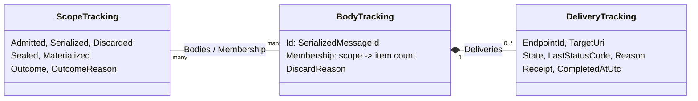

# OMF 2.0 Awaitable Acceptance: Implementation Progress

**Date:** 2026-10-07  
**Updated:** 2026-10-08, Phase 1 stragglers and Phase 2; 2026-10-09, MVP Phase 3  
**Branch:** `features/acceptance-api`, based on 2261f3a  
**Design documents (Research repo, `4981647-test-apps/docs`):**

- `2026-09-25-adapter-framework-omf-awaitable-acceptance-confirmation-plan.md` (the plan)
- `2026-10-01-adapter-framework-omf-acceptance-only-api.md` (the acceptance-only API this branch implements)
- `2026-10-07-adapter-framework-omf-acceptance-departures.md` (where the implementation departs from the plan)
- `2026-10-09-adapter-framework-omf-acceptance-mvp-plan.md` (proposed MVP: no confirmation or hot failover; V4 writer records)

This note records what's done on the branch, how it works, and answers to questions raised during
the review.

---

## 1. Status

| Item | State |
| --- | --- |
| AW-1. `SerializationBlock` single-producer violation | Done |
| AW-2. Failover conversion drops the OMF version and partition key | Done |
| Phase 1. Contracts and coordinator | Done, including host wiring |
| Phase 2. Scope identity through grouping and serialization | Done. Scopes can be created on OMF 2.0 pipelines, but waits end in `TimedOut` until Phase 4 registers deliveries. |
| Phase 3. Persistence | MVP Phase 3 done: `V4` writer records and the per-file serialized-ID index. Phase 4 reports the losses to the coordinator. |
| Phase 4. Delivery and acceptance | Not started |
| Phase 6. Hot failover | Not started |
| Phase 7. Client-level monitoring (optional) | Not started |

Phase 5 (deep confirmation) is out of scope for the acceptance-only API.

---

## 2. Changes

### 2.1 AW-1: concurrent producers into `SerializationBlock`

Two grouping blocks post to `SerializationBlock` concurrently, but it declared a single producer, so
TPL Dataflow could use a queue that isn't safe for concurrent posts.

- [SerializationBlock.cs](../Src/AdapterFramework.Data.Framework.DataFlow/SerializationBlock.cs) now passes
  `singleProducer: false`.
- [SerializationBlock_Tests.cs](../Tests/AdapterFramework.Data.Framework.DataFlow.Tests/SerializationBlock_Tests.cs)
  adds `SerializationBlock_ConcurrentProducers_HandleEveryMessageOnce`: two threads post 5,000
  messages each, for OMF 1.2 and OMF 2.0, and every message must be handled exactly once.

### 2.2 AW-2: failover keeps the OMF version and partition key

Hot failover rebuilt each body with the OMF 1.2 default and no partition key, so OMF 2.0 bodies were
resent with the wrong header.

- [FailoverSerializedOmfMessage.cs](../Src/AdapterFramework.Data.Framework.Failover/Messages/FailoverSerializedOmfMessage.cs)
  takes the OMF version and partition key and includes them in its size.
- [FailoverDataMessageProcessor.cs](../Src/AdapterFramework.Data.Framework.Failover/FailoverDataMessageProcessor.cs)
  copies both when it converts a message.
- [FailoverPersistentOmfMessageQueue.cs](../Src/AdapterFramework.Data.Framework.Failover/Messages/FailoverPersistentOmfMessageQueue.cs)
  writes `DataItemVersion.V3` records (type, item count, body, process time, partition key, action,
  OMF version) and still reads legacy `V2` records.
- Tests cover an OMF 2.0 round trip through the disk record, a legacy `V2` record, and a hot-mode
  message buffered on the secondary and sent after promotion.

**Rollback risk:** older builds ignore the record version and misread `V3` failover records: the body
gains two junk bytes, the process time is garbage, and the action is wrong. Decided 2026-10-08: ship in
one release, and the release notes say to drain or delete the failover buffer before rolling back. See
departures §2.4.

### 2.3 Phase 1: public contracts

[Abstractions/MessageProcessing/Awaitable](../Src/AdapterFramework.Data.Framework.Abstractions/MessageProcessing/Awaitable)
holds the acceptance-only API:

| Type | Purpose |
| --- | --- |
| `IAwaitableMessageProcessor`, `IAwaitableAdapterMessageProcessor` | Create scopes with `TryCreateAwaitableScope` |
| `IAwaitableScope`, `IAwaitableMessageScope`, `IAwaitableAdapterMessageScope` | `Seal`, `WaitForAcceptanceAsync`, `DisposeAsync`, plus the existing write methods |
| `OmfAwaitableScopeOptions`, `OmfAwaitableEndpointMode` | Endpoint mode, default wait timeout (15 minutes), `FlushOnSeal` |
| `OmfAcceptanceResult`, `OmfAcceptanceOutcome` | Scope outcome and every delivery |
| `OmfDeliveryResult`, `OmfDeliveryState`, `OmfIngressReceipt` | One body sent to one endpoint |
| `OmfOutcomeReason`, `OmfReasonCode`, `OmfPipelineStage`, `OmfReasonCodeExtensions` | Why something is in its state; messages are capped at 1,024 characters |
| `ScopeToken` | Scope identity passed through the pipeline; no public members |

Reason codes have fixed numeric values, so codes added later can't shift existing ones.

### 2.4 Phase 1: coordinator

[Messages/Awaitable](../Src/AdapterFramework.Data.Framework.Messages/Awaitable) holds the coordinator.
The Messages project is the lowest project that the dataflow, buffering, endpoint manager, and egress
projects all reference.

| Type | Purpose |
| --- | --- |
| `OmfAwaitableCoordinator` | Tracks scopes, bodies, and deliveries, and decides outcomes |
| `OmfAwaitableScopeState` | One scope's sealing, waits, and disposal. It derives from `ScopeToken`, so it is also the scope's token. |
| `OmfDeliveryTarget` | One endpoint writer in the snapshot taken when a body is dispatched |

[OmfAwaitableCoordinator_Tests.cs](../Tests/AdapterFramework.Data.Framework.Messages.Tests/Awaitable/OmfAwaitableCoordinator_Tests.cs),
in the new test project `AdapterFramework.Data.Framework.Messages.Tests`, drives the coordinator
with a simulated pipeline. [OmfOutcomeReason_Tests.cs](../Tests/AdapterFramework.Data.Framework.Abstractions.Tests/MessageProcessing/Awaitable/OmfOutcomeReason_Tests.cs)
covers reason codes and message truncation. The new test project is added to `AdapterFramework.sln`
by hand, because `dotnet sln add` adds x64 and x86 configurations to every project.

### 2.5 Phase 1: host wiring

- [EgressComponentExtensions.cs](../Src/AdapterFramework.Data.Framework.EgressComponent/Extensions/EgressComponentExtensions.cs)
  registers one `OmfAwaitableCoordinator` singleton in `AddEgress`.
- [DataMessageProcessor.cs](../Src/AdapterFramework.Data.Framework.EgressComponent/DataMessageProcessor.cs)
  takes the coordinator as an optional last constructor parameter and sets the OMF version from the
  application manifest.
- [FailoverDataMessageProcessor.cs](../Src/AdapterFramework.Data.Framework.Failover/FailoverDataMessageProcessor.cs)
  takes the coordinator as an optional last constructor parameter and sets the failover mode in
  `UpdateMode`.
- Both parameters default to null, so existing callers and test doubles are unchanged.
- Tests check the singleton registration, that OMF 2.0 allows scopes and OMF 1.2 doesn't, and that
  hot mode blocks scopes until the mode changes to warm.

### 2.6 Phase 2, step 1: scope identity through the processor chain

- `IScopedMessageProcessor` (Abstractions) mirrors the 14 `IMessageProcessor` writes, each with a
  required trailing `ScopeToken`, plus `TryCreateScope`.
- [DataMessageProcessor.cs](../Src/AdapterFramework.Data.Framework.EgressComponent/DataMessageProcessor.cs)
  implements it. Each unscoped write is a one-line wrapper that passes `null`. A scoped write tags the
  envelope with `Message.Scope`, records the admitted item count, and posts to the OMF 2.0 grouping
  block; a refused post records `Admission/PostRejected`. It also installs the seal handler that posts
  seal barriers.
- [InstrumentedMessageProcessor.cs](../Src/AdapterFramework.Data.Framework.MessageProcessor/InstrumentedMessageProcessor.cs)
  implements it and forwards the token.
- [AdapterMessageProcessor.cs](../Src/AdapterFramework.Data.Framework.MessageProcessor/AdapterMessageProcessor.cs)
  has a `protected internal virtual` core method per write. Data filters run in the core methods, so a
  held-back value is emitted with the scope of the write that releases it.
  [HistoryRecoveryAdapterMessageProcessor.cs](../Src/AdapterFramework.Data.Framework.AdapterCommon/HistoryRecovery/HistoryRecoveryAdapterMessageProcessor.cs)
  overrides the dynamic-value core methods, so it still counts scoped writes.
- [ScopedMessageProcessor.cs](../Src/AdapterFramework.Data.Framework.Messages/Awaitable/ScopedMessageProcessor.cs)
  wraps a processor without scope support; its `TryCreateScope` throws `NotSupportedException`.
- The scope classes [AwaitableMessageScope.cs](../Src/AdapterFramework.Data.Framework.Messages/Awaitable/AwaitableMessageScope.cs)
  and [AwaitableAdapterMessageScope.cs](../Src/AdapterFramework.Data.Framework.MessageProcessor/AwaitableAdapterMessageScope.cs)
  wrap each write in `EnterWrite`/`ExitWrite`, so `Seal` waits for writes in flight and later writes throw.

### 2.7 Phase 2, step 2: sidecars and barriers in the grouping blocks

**Terms.** An *entry* is one position in one of a grouped message's lists: a type, container,
relationship, entity, event, or stream. A *value* is one value inside a stream. The code avoids
"element", which also means an AF element in the PI System.

- [InstanceScopeSidecar.cs](../Src/AdapterFramework.Data.Framework.Messages/Awaitable/InstanceScopeSidecar.cs)
  and [SchemaScopeSidecar.cs](../Src/AdapterFramework.Data.Framework.Messages/Awaitable/SchemaScopeSidecar.cs)
  are attached to `InstanceMessage` and `SchemaMessage` as `Sidecar`, and are null when no item is
  scoped. They have the plan's lists: stream values as `ScopeRange(scopeIndex, start, count)` runs, and
  one scope index per other entry (-1 for unscoped). Their base,
  [ScopeSidecar.cs](../Src/AdapterFramework.Data.Framework.Messages/Awaitable/ScopeSidecar.cs), counts the
  scoped items of any window with `AddEntries` and `AddValues`.
- [ScopeSidecarBuilder.cs](../Src/AdapterFramework.Data.Framework.DataFlow/ScopeSidecarBuilder.cs) is
  created by a grouping block on the first scoped item and dropped after each flush, so unscoped traffic
  pays a null check. Adjacent runs from the same scope merge. Embedded relationships take the
  envelope's scope.
- [InstanceGroupingBlock.cs](../Src/AdapterFramework.Data.Framework.DataFlow/InstanceGroupingBlock.cs) and
  [SchemaGroupingBlock.cs](../Src/AdapterFramework.Data.Framework.DataFlow/SchemaGroupingBlock.cs) handle
  `ScopeSealBarrier`. If the block buffers nothing for the scope, it forwards a
  `ScopeMaterializationBarrier` at once. Otherwise it waits for the next flush (immediately with
  `FlushOnSeal`) and posts the barrier right after the grouped messages.
- `SchemaGroupingBlock.FlushDue` now counts relationships, so a relationship-only buffer flushes on the
  timer.

### 2.8 Phase 2, step 3: serialization

- [SerializationBlock.cs](../Src/AdapterFramework.Data.Framework.DataFlow/SerializationBlock.cs) takes the
  coordinator as an optional last constructor parameter. Every split path carries a `Slice`: the sidecar,
  the list, and the absolute position of the array being split (or, for one stream's values, the
  stream and the absolute value position). Recursion adds the segment offset, so ranges are never
  rebased.
- Just before the flush action, a body with scoped items gets a `SerializedMessageId` and is registered
  with its per-scope counts.
- A single item or value too large to send records `Serialization/ItemTooLarge`. A single oversized
  type, container, relationship, entity, or event used to recurse until the stack overflowed; it now
  logs an error and is dropped.
- `ScopeMaterializationBarrier`s are counted per scope; when the expected count arrives, serialization
  calls `CloseMaterialization`, which runs the count check.

### 2.9 Phase 2 tests

| Test | Covers |
| --- | --- |
| [ScopeSidecar_Tests.cs](../Tests/AdapterFramework.Data.Framework.Messages.Tests/Awaitable/ScopeSidecar_Tests.cs) | Range clipping, whole-stream counts, unscoped entries |
| [ScopeTracking_Tests.cs](../Tests/AdapterFramework.Data.Framework.DataFlow.Tests/ScopeTracking_Tests.cs) | Sidecars from both grouping blocks; barriers with and without `FlushOnSeal`, for an unbuffered scope, and after a partition-key-only flush; a stream split across bodies; oversized value and entity; barrier counting |
| [AwaitableAdapterMessageScope_Tests.cs](../Tests/AdapterFramework.Data.Framework.MessageProcessor.Tests/AwaitableAdapterMessageScope_Tests.cs) | Unsupported chain throws; scoped writes reach the scoped overloads; writes after `Seal` throw |
| `DataMessageProcessor_ScopedWritesMixedWithUnscoped_EveryAdmittedItemIsAccepted` in [DataMessageProcessor_Tests.cs](../Tests/AdapterFramework.Data.Framework.EgressComponent.Tests/DataMessageProcessor_Tests.cs) | End to end through a real OMF 2.0 pipeline. A test double accepts each registered body, so `Accepted` proves every admitted item was registered. |

The end-to-end test needs a non-null logger: with a null logger, the first oversized grouped message
throws inside `SerializationBlock` (an existing `_logger.LogTrace` call), and the scope times out.

### 2.10 Running the tests

```powershell
dotnet test Tests\AdapterFramework.Data.Framework.Messages.Tests
dotnet test Tests\AdapterFramework.Data.Framework.Abstractions.Tests --filter "FullyQualifiedName~Awaitable"
dotnet test Tests\AdapterFramework.Data.Framework.Failover.Tests
dotnet test Tests\AdapterFramework.Data.Framework.EgressComponent.Tests
dotnet test Tests\AdapterFramework.Data.Framework.DataFlow.Tests
dotnet test Tests\AdapterFramework.Data.Framework.MessageProcessor.Tests
dotnet test Tests\AdapterFramework.Data.Framework.AdapterCommon.Tests
dotnet test Tests\AdapterFramework.Data.Framework.PersistentQueue.Tests
dotnet test Tests\AdapterFramework.Data.Framework.Buffering.Tests
```

The DataFlow, EgressComponent, EndpointManager, and AdapterCommon suites take minutes. Last full run
(2026-10-09, after Phase 3): every test project passes, including PersistentQueue 87, Buffering 76,
Messages 40, DataFlow 170, EgressComponent 87, EndpointManager 206, AdapterCommon 543.

### 2.11 Phase 3: V4 writer records

- `ISerializedOmfMessage` gains `Guid? SerializedMessageId`, a default member that returns `null`, so
  other implementers and test doubles are unchanged. `SerializedOmfMessage` already had it.
- [SerializedOmfMessage.cs](../Src/AdapterFramework.Data.Framework.Messages/SerializedOmfMessage.cs):
  `GetMessageSizeInBytes` adds 16 bytes when the ID is set.
- [DataItemVersion.cs](../Src/AdapterFramework.Data.Framework.PersistentQueue/Queue/DataItemVersion.cs)
  adds `V4`, and [Serializer.cs](../Src/AdapterFramework.Data.Framework.PersistentQueue/Queue/Serializer.cs)
  gives it its own 8-byte record start marker.
- [PersistentOmfMessageQueue.cs](../Src/AdapterFramework.Data.Framework.Buffering/PersistentOmfMessageQueue.cs)
  writes `V4` only for bodies with an ID: the `V3` layout (type, item count, body, partition key,
  action, OMF version) followed by the 16-byte ID. Unscoped bodies are still written as `V3`. It reads
  `V1` to `V4`; only `V4` records load with an ID. Peeked and dequeued bodies keep their ID.
- No `ProcessTimeTicks`, as decided for the MVP.

**Rollback.** An older build doesn't recognize the `V4` start marker, so its file queue treats each
`V4` record as corrupt: it logs an error, skips the record, and continues with the next `V1` to `V3`
record. Scoped bodies on disk at rollback are lost; unscoped bodies are not. The MVP plan (§3.2) said
the older build would read them as empty-body messages; that case can't be reached, because the file
queue rejects the record first. The release-note mitigation is unchanged.

### 2.12 Phase 3: per-file serialized-ID index

The index lives in [FileQueue.cs](../Src/AdapterFramework.Data.Framework.PersistentQueue/Queue/FileQueue.cs),
the only code that knows which file and position each record went to and when files are skipped or
deleted.

- `DataItem` gains `TrackingId`, set from the serialized ID. It is held in memory and never written.
- Before writing an item with a tracking ID, the queue records its file number and record start
  position, and removes the entry if the write fails. Recording first means the reader can never
  reach a record whose entry is missing.
- On dequeue, the queue works out the record's start from the reader position and the record size.
  The matching entry is removed silently; entries before it in the same file were skipped as corrupt.
- `IPersistentQueue.TrackedItemsLost` reports lost IDs with a reason:

| Where the queue loses entries | Reason | `OmfReasonCode` |
| --- | --- | --- |
| Records skipped as corrupt during a dequeue, or left in a file the reader moves past normally | `Unreadable` | `CorruptRecord` |
| The reader forced off a file to stay within the file limit, or to free disk space | `Evicted` | `BufferFull` |
| Files deleted by `UpdateMaxQueueFiles` | `Evicted` | `BufferFull` |
| `DeleteBuffers` | `Cleared` | `BuffersReset` |

- [PersistentOmfMessageQueueBase.cs](../Src/AdapterFramework.Data.Framework.Buffering/PersistentOmfMessageQueueBase.cs)
  maps the reason, logs a warning, and raises `SerializedBodiesDiscarded`. Nothing subscribes yet:
  Phase 4 forwards it to the coordinator with the endpoint ID.
- The index covers only the running process, because scopes don't survive a restart. Records from an
  earlier run aren't indexed.
- Both events are raised while the queue holds its locks, so handlers must not call back into the
  queue. The coordinator doesn't.
- `IPersistentQueue.TrackedItemsLost` is a default member with empty accessors, so other
  implementers are unchanged.

Not in Phase 3 (MVP Phase 4, step 4): a write that still fails after freeing disk space stays in the
queue's pending list and is written by a later flush, so it isn't lost yet; and an item larger than a
queue file throws on enqueue.

### 2.13 Phase 3 tests

| Test | Covers |
| --- | --- |
| [FileQueue_TrackingTests.cs](../Tests/AdapterFramework.Data.Framework.PersistentQueue.Tests/FileQueue_TrackingTests.cs) | Dequeued and peeked items aren't reported, across a file change; a corrupted record is reported `Unreadable` and the next one isn't; the file limit and `UpdateMaxQueueFiles` report `Evicted`; `DeleteBuffers` reports `Cleared` |
| `Serializer_SerializeDeserializeDataItem_Success` in [Serializer_Tests.cs](../Tests/AdapterFramework.Data.Framework.PersistentQueue.Tests/Serializer_Tests.cs) | Adds `V3` and `V4` records |
| [PersistentOmfMessageQueue_Tests.cs](../Tests/AdapterFramework.Data.Framework.Buffering.Tests/PersistentOmfMessageQueue_Tests.cs) | A scoped body is written as `V4` with the ID last and as the tracking ID; an unscoped body is still `V3`; both round-trip with every field, and only the scoped one has an ID; each loss reason maps to its reason code |

Existing tests already cover reading `V1` to `V3` records.

---

## 3. How the coordinator works

The coordinator keeps track of scopes in memory. Pipeline stages report what happened to each
scope's data, and the coordinator decides when a scope's outcome is final and wakes its waiters. It
never sends, retries, or cancels anything.

### 3.1 What it tracks



- **Scope:** counts of items admitted, serialized into bodies, and dropped, plus two flags. *Sealed*
  means no more writes; *materialized* means every body containing the scope's items is known.
- **Body:** one serialized HTTP body and the number of items it carries per scope. One body can
  carry several scopes' items, and one scope can span several bodies.
- **Delivery:** one body sent to one endpoint. It starts `Pending` with reason `Queued`.

A body is tracked only if it carries a scoped item, so writes made without a scope cost one failed
lookup. Reports about unknown scopes or bodies are ignored.

### 3.2 Reports from the pipeline

| Reported by | Method | Effect |
| --- | --- | --- |
| `DataMessageProcessor`, before posting to a grouping block | `RecordAdmitted` | Adds to `Admitted` |
| Any stage that drops an item | `RecordItemsDiscarded` | Adds to `Discarded`; the scope fails |
| `SerializationBlock`, before dispatch | `RegisterBody` | Creates the body and adds to `Serialized` per scope |
| `SerializationBlock`, when every barrier has arrived | `CloseMaterialization` | Sets `Materialized` and checks counts |
| `OmfEndpointManager`, before sending | `RegisterDeliveries` | One delivery per endpoint; no endpoints means `NoEndpoints` |
| `OmfWriter`, retryable attempt | `RecordAttempt` | Updates `LastStatusCode` and `Reason`; still pending |
| `OmfWriter` and queues, final decision | `RecordDisposition` | Accepted, rejected, discarded, or peer-covered; the first one wins |
| `OmfEndpointManager`, writer removed | `RecordEndpointDiscarded` | Discards that endpoint's pending deliveries |

The count check in `CloseMaterialization` catches items lost without a report: if
`Admitted > Serialized + Discarded`, the shortfall is recorded as `Discarded` (`CountMismatch`).

### 3.3 Deciding the outcome

After each report that could change a scope, the coordinator applies these rules in order:

1. If the outcome is already final, stop. Later reports still update delivery states.
2. If the report was a failure and the scope can no longer succeed, the outcome is `Rejected` or
   `Discarded`, with that report's reason. This can happen before sealing or materialization.
   - Any item was dropped, or any body was discarded.
   - `AllActiveEndpointsAtDispatch`: any delivery failed, unless the failover peer covers that body.
   - `AnyCompleteEndpoint`: no endpoint is left that could still accept every body.
3. If the scope isn't sealed, stop.
4. If nothing was admitted, the outcome is `Filtered`.
5. If the scope is materialized and every requirement is met, the outcome is `Accepted`, or
   `PeerCovered` if any body was satisfied only by the failover peer.
   - `AllActiveEndpointsAtDispatch`: every delivery of every body is accepted.
   - `AnyCompleteEndpoint`: one endpoint accepted every body.

### 3.4 Waiting

`WaitForAcceptanceAsync` seals the scope, then waits for the first of:

- **A final outcome.** It returns the outcome and a snapshot of every delivery.
- **The timeout.** It returns `TimedOut` and tracking continues, so a later wait can still see the
  outcome. The reason names the earliest unfinished stage: `AwaitingFlush` while the scope isn't
  materialized, "waiting for dispatch" when a body has no deliveries yet, and otherwise the
  earliest-stage reason among pending deliveries.
- **Scope disposal or coordinator shutdown.** It throws `OperationCanceledException`.

### 3.5 Lifecycle and threading

- `TryCreateScope` throws `NotSupportedException` unless the OMF version is 2.0 and hot failover is
  off, and returns `false` at the active-scope limit (1,000 by default, a placeholder).
- Disposing a scope frees its slot under the limit, cancels its waits, and drops bodies no remaining
  scope uses. Delivery is never cancelled.
- Disposing the coordinator is framework shutdown: every wait is cancelled and no new scopes can be
  created.
- All state changes happen under one lock. Waiters are woken after the lock is released, and their
  continuations run asynchronously, never on the reporting thread.

---

## 4. How a scope's data flows

Steps 1–4 are implemented (Phase 2); step 5 is Phase 4. The departures document records where they
differ from the plan.

1. **Admission (Phase 2).** A scope starts with no count. Each write through the scope runs the
   normal processor chain, including data filters. Just before `DataMessageProcessor` posts an
   envelope to a grouping block, it calls `RecordAdmitted` with that envelope's item count. Counts
   are items: values for streaming data, and one per type, stream, relationship, entity, and event.
   Filtered values are never counted, and a scope with nothing admitted when
   it's sealed completes as `Filtered`.
2. **Grouping (Phase 2, step 2).** Grouping blocks attach a *sidecar* to each grouped message. It's
   never serialized. Streaming values get run-length ranges `(scopeIndex, start, count)` per stream;
   every other entry gets one scope index; unscoped data gets nothing.
3. **Serialization (Phase 2).** Serialization slices the sidecars through every split. Just before
   each body is sent on, it calls `RegisterBody` with the body's per-scope counts. Dropped items,
   such as one too large to send, are reported with `RecordItemsDiscarded`.
4. **Materialization (Phase 2).** Sealing posts a seal barrier to both OMF 2.0 grouping blocks. Once
   a block has emitted the grouped message with the scope's last items, it sends a
   materialization barrier after it. When barriers from both blocks reach serialization, it
   calls `CloseMaterialization`, which runs the count check. Without this step the coordinator
   can't tell the last body from one still in a grouping block, so `Accepted` is never reached.
5. **Dispatch and delivery (Phase 4).** The endpoint manager calls `RegisterDeliveries` with its
   writer snapshot before sending. Each writer reports attempts and a final disposition.

Acceptance needs both: materialization closed, and every required delivery accepted.

---

## 5. Questions and answers

### 5.1 What does `OmfDeliveryResult.LastStatusCode` mean?

The status of the most recent HTTP attempt. The writer can retry a body several times, so earlier
attempts may have returned different statuses. For example, a delivery retrying a 401 shows
`LastStatusCode` 401 with reason `Delivery/Retrying`.

### 5.2 Why was `LastProcessedOperationId` removed from `OmfIngressReceipt`?

Nothing used it. Operation IDs are GUIDs, so it can't show how far the platform has progressed
relative to a body. Removing a parameter from a positional record after release would break callers,
while adding one later as an `init` property wouldn't. The acceptance-only API document was updated
to match.

### 5.3 Which choices did the plan leave open, and are they settled?

They are implemented and tested, and recorded in the departures document:

| Choice | State |
| --- | --- |
| Failures complete the outcome early, before materialization | Implemented and tested. Departs from plan §7.9. |
| `AnyCompleteEndpoint` with non-overlapping endpoint sets gives `Discarded` (`NoEndpoints`) | Implemented and tested |
| A mix of local and peer coverage gives `PeerCovered` | Implemented and tested in both endpoint modes. It can't happen in practice before Phase 6. |
| Active-scope limit of 1,000 | Placeholder; still an open decision (§6) |
| AW-2 failover records in one release instead of two | Decided 2026-10-08, with a release note (§2.2) |

### 5.4 When do non-overlapping endpoint sets occur?

Only when endpoint configuration changes during a scope, in `AnyCompleteEndpoint` mode. Each body
records the endpoint writers that exist when it's dispatched. For example:

1. Body 1 is dispatched while only endpoint A exists, and A accepts it.
2. An operator replaces A with endpoint B.
3. Body 2 is dispatched to {B}.

A never got body 2 and B never got body 1. Acceptances aren't combined across endpoints, so the scope
can't succeed. Without the check, every wait would time out. It can also happen when an endpoint's
ID changes while its URL stays the same, or when a writer can't be created during a reload. If A
hadn't yet accepted body 1, removing A would already fail the scope with `EndpointRemoved`.
`AllActiveEndpointsAtDispatch` is unaffected, because each body needs only its own endpoints.

### 5.5 Can delivery tracking grow without bound if the writer retries indefinitely?

Not because of retries. Tracking is one entry per body per endpoint, and each attempt overwrites
`LastStatusCode` and `Reason`, so retries add nothing. Total tracking is roughly active scopes ×
bodies per scope × endpoints:

- Active scopes are capped by the limit. During an outage scopes don't complete, the limit is
  reached, and new writes fall back to fire-and-forget.
- Endpoints are few.
- **Bodies per scope aren't capped.** A long-lived scope, such as one around a large backfill, keeps
  adding bodies. Scopes that are never disposed also hold their tracking.

Scopes are meant for bounded units of work, such as one page or one scan interval. A per-scope body
limit can be added if real use needs it.

`Tracking_AtActiveScopeLimitDuringOutage_StaysBoundedAndIsReleasedOnDispose` covers plan §15.8: two
scopes at the limit with 50 bodies each and two endpoints receive 200 retry attempts per delivery.
The tracked body count stays at 100, each delivery keeps only its latest reason, new scopes are
refused, and disposing both scopes releases every body.

### 5.6 Which phase adds the grouping block sidecars?

Phase 2, step 2, together with seal and materialization barriers and `FlushOnSeal`. Step 1 passes the
scope token through the processor chain, and step 3 slices the sidecars through serialization and
registers bodies. All three are done (§2.6–§2.8).

### 5.7 What was left of Phase 1, and how was it closed?

| Item | Resolution |
| --- | --- |
| Host wiring | Done (§2.5). The coordinator is a singleton, and the OMF version and failover mode reach it from the pipeline. |
| Mixed peer-coverage test | Done, for both endpoint modes |
| Bounded memory during an outage (plan §15.8) | Done (§5.5) |
| Shutdown order (plan §12) | Safe today; becomes structural in Phase 4 (below) |
| Metrics (plan §7.9) | Deferred to Phase 4, when there are real events to count |

**Shutdown order.** Plan §12 cancels waits only after producers and writers stop. The host stops
adapters in `HostedComponentsService.StopAsync` before the container disposes anything, so no adapter
is still waiting when the coordinator is disposed. The container disposes singletons in reverse order
of creation. Today the coordinator is created after the endpoint manager, so it's disposed before the
writers' final flush. That doesn't matter yet, because nothing waits by then. In Phase 4 the endpoint
manager and writers depend on the coordinator, so it's created before them and disposed after them.

**Known gap until Phase 6.** Changing the failover mode to hot while scopes are active blocks new
scopes, but doesn't touch existing ones. Their later bodies go to the failover buffer, never get
deliveries, and their waits time out. Mode changes are rare configuration events, and Phase 6
defines what happens to them.

### 5.8 Why is hot failover rejected?

On a hot secondary, a scope's data is never sent from that node:

1. The secondary keeps its bodies in a local failover buffer instead of passing them to its endpoint
   writers, so no deliveries are registered and no 202 arrives. Waits would always time out.
2. The secondary deletes ("trims") buffered bodies older than the primary's reported time, without
   reporting anything, so the scope can't tell delivered data from lost data.
3. The primary reports the time it handed a body to its writers, not the time an endpoint accepted
   it. If the primary dies with unsent data, the secondary may already have trimmed its copy.
   Treating a trim as `PeerCovered` would report acceptance for data accepted nowhere.
4. Roles can change at every heartbeat. A check on the current role would be stale immediately, and
   before Phase 3 failover records don't carry the serialized ID needed to match bodies to scopes
   after promotion.

Phase 6 adds an acceptance-based watermark, records `PeerCovered` on trim and `Discarded` when the
failover buffer is deleted, and then allows scopes in hot mode.

### 5.9 Does acceptance work with warm or cold failover?

Yes. In warm and cold modes the failover processor doesn't buffer, and every body goes straight to
the endpoint manager in either role, so scopes follow the normal path. The plan's Phase 4 exit
criterion includes warm and cold. Caveats:

- Scopes are in-process. If a node fails over because its process died, its scopes are gone; the
  new primary starts new scopes and re-reads anything not acknowledged from the source checkpoint.
- A warm or cold secondary that produces data also sends it, so its scopes complete normally.
- Delivery across a role change is at-least-once. Writes should use identifiers derived from the
  source data, so duplicates overwrite instead of piling up.

### 5.10 What does materialization mean?

A scope is materialized when every item it admitted is either in a registered body or recorded as
discarded. It's per scope, and says nothing about sending: `Accepted` needs materialization closed and
every required delivery accepted. Without it, the coordinator can't tell the scope's last body from
items still buffered in a grouping block.

### 5.11 How can a grouping block post a materialization barrier without knowing the bodies?

It relies on queue order, not on knowledge of bodies. There are two moments:

1. **The grouping block posts the barrier** once it holds nothing more of the scope. The seal barrier
   arrived after every write of the scope (`Seal` waits for writes in flight, and the block's queue is
   first in, first out), so after the next flush every item has been handed on. The block posts the
   barrier through the same `_flush` action as its grouped messages, so it's queued in serialization
   behind them. No body exists yet at this point.
2. **Serialization closes materialization** when it dequeues the barrier. It handles one message at a
   time, and splitting and every `RegisterBody` call happen inside that handling, so every body cut
   from the earlier grouped messages is registered by then.

Serialization receives from two producers, the schema and instance blocks. Each keeps its own order,
but their messages interleave, so serialization waits for a barrier from both before calling
`CloseMaterialization`.

### 5.12 Does a known drop wait for the count check?

No. Recording a drop (for example `ItemTooLarge`) or a failed delivery evaluates the scope at once.
A dropped item can't be accepted by any endpoint, so the scope completes as `Discarded` (or
`Rejected`) immediately and waiters are released (departures §2.1). The count check still runs when
the barriers arrive, but the first outcome is final. Only `Accepted` and `PeerCovered` wait for
materialization.

### 5.13 What are membership and `Slice` in `SerializationBlock`?

*Membership* is one body's per-scope item count, a `Dictionary<ScopeToken, int>` that `Flush` passes
to `RegisterBody`. It's computed from the sidecar, which uses positions in the original grouped message.

- When a whole list goes into one body, the static `Membership` helper counts the list from position 0.
  Calls nest when one body holds several lists; `DiscreteMembership` covers events, entities, and
  relationships.
- When a list is split, the chunking methods recurse on copies that start at index 0. `Slice` travels
  with each copy and remembers the original position of its first entry (`Offset`), and, for one
  stream's values, which stream (`Stream`). `At(offset)` adds the segment offset when recursing,
  `ValuesOfFirstStream()` switches from counting streams to counting one stream's values, and
  `Membership(start, count)` counts at original positions. `Discard` uses the same counting to report
  `ItemTooLarge` against the right scope.

### 5.14 Why are there two sidecar types?

`InstanceScopeSidecar` and `SchemaScopeSidecar` keep the plan's named lists, so a sidecar can't hold a
list its message doesn't have. Their abstract base `ScopeSidecar` holds the scope table and the
counting methods, so serialization treats both the same way. An earlier single type indexed its lists
by enum, which was harder to follow.

---

## 6. Decisions

Decided on 2026-10-08:

| Decision | Choice | Record |
| --- | --- | --- |
| AW-2 failover records | One release; release notes say to drain or delete the failover buffer before rollback | Departures §2.4 |
| Serialized ID in persisted records (Phase 3) | Only scoped bodies carry one; unscoped and legacy records load without one | Departures §2.8 |
| V4 writer records (Phase 3) | One release; release notes say to drain or delete the endpoint buffers before rollback. Confirmed for the MVP on 2026-10-09, instead of an in-memory side table. | Departures §2.10 |
| V4 contents (Phase 3) | Decided 2026-10-09: written only for bodies with a serialized ID, so unscoped bodies stay `V3`; no `ProcessTimeTicks` until hot failover | MVP plan §3.1 |

Still open:

| Decision | Needed by | Notes |
| --- | --- | --- |
| Active-scope limit | Before release | Placeholder 1,000 |
| Move AW-2 out of this work into a separate change | Any time | AW-2 fixes an existing bug (failover records drop the OMF version and partition key). Acceptance doesn't need it before Phase 6, because scopes are refused in hot failover and warm and cold failover don't use the failover buffer. Moving it removes the failover rollback concern from this work. Departures §2.4. |
| Replace the `Membership` helper with `Slice` everywhere in `SerializationBlock` | Any time | Readability only |
| Guard the null logger in `SerializationBlock` | Optional | Predates this branch. With a null logger, the first oversized message throws inside the block. |

---

## 7. Phase 2 tests compared with plan §15

Not covered yet. None of these block Phase 3, which depends only on AW-2.

- **§15.2:**
  - scoped writes through every write method and filter path carry the token at the
    `DataMessageProcessor` level, and `ResendTypesAndStreams` carries none;
  - a deadband write that emits two envelopes counts both;
  - a fully filtered scope through the processor chain completes as `Filtered`, which is covered only
    at the coordinator;
  - history recovery counts scoped writes.
- **§15.3:**
  - sidecar slicing through the schema chunking path and the multi-stream `FlushInChunks` path is
    exercised only by the end-to-end test;
  - an injected unreported drop caught by the count check is covered only at the coordinator;
  - no test asserts that scope metadata never reaches OMF JSON or headers. This holds by construction,
    because the sidecar isn't part of the serialized wrappers.

---

## 8. Next steps

1. Phase 4: make the endpoint manager and writers depend on the coordinator, register deliveries and
   dispositions, which also fixes the shutdown order (§5.7), and add coordinator metrics. This
   includes forwarding `SerializedBodiesDiscarded` from each writer's persistent queue to the
   coordinator with the writer's endpoint ID (§2.12), and the queue-level dispositions that Phase 3
   leaves out.
2. Close the Phase 2 test gaps in §7 before the MVP ships.
